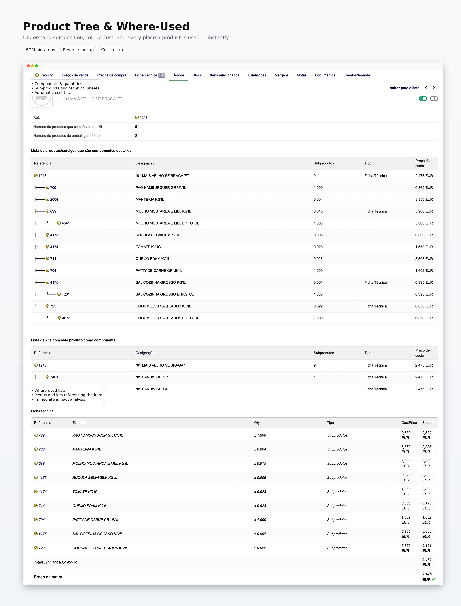
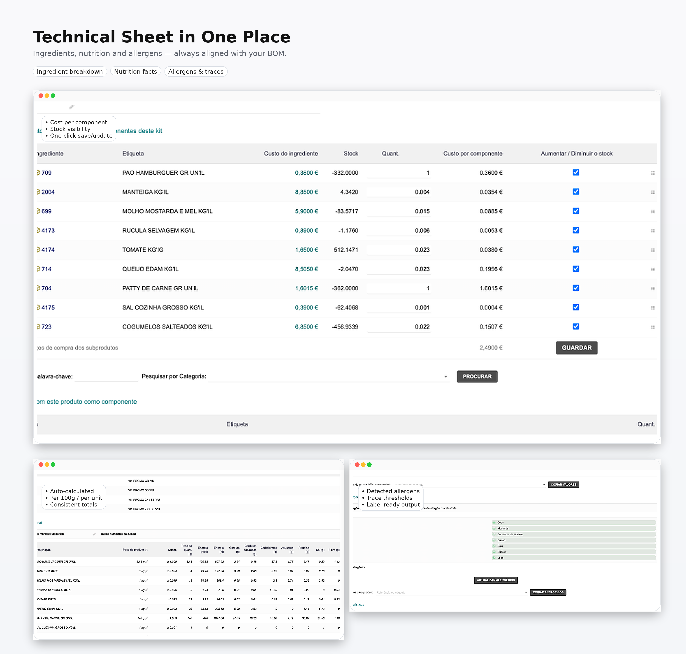

<!-- Copyright (C) 2024-2026       Kreativitat             <mail@kreativitat.com> -->

# KreaProducts per a Dolibarr ERP/CRM

KreaProducts és un mòdul avançat per a la gestió de productes a [Dolibarr ERP/CRM](https://www.dolibarr.org). Amplia el mòdul de Productes amb nutrició, al·lèrgens, BOM/Fitxes tècniques, inventari i automatitzacions de costos i estoc — pensat per a la restauració i el comerç al detall que necessiten consistència, traçabilitat i _food cost_ sempre correcte.

## Funcionalitats

### Nutrició i al·lèrgens

- Taula nutricional amb càlcul, validació i actualització automàtica.
- Propagació de nutrients entre productes pare/fill, incloent BOM (MRP) quan està actiu.
- Gestió d'al·lèrgens amb propagació per percentatge del pes total i marcatge de traces.
- Suport a productes no alimentaris (exclosos del càlcul).

### Estructura de productes i BOM

- Arbre complet de productes (associacions + BOM/MRP, quan està actiu), amb navegació jeràrquica.
- Visualització detallada de la composició del producte (components, quantitats i subproductes), amb totalització del **preu de cost**.
- Identificació clara de les relacions entre productes i fitxes tècniques, incloent **embalatges d'origen** quan escau.
- Vista inversa (_on s'utilitza_): llista de kits/fitxes tècniques i menús on l'article entra com a component, permetent avaluar l'impacte de canvis de cost, substitucions i normalització de matèries primeres.
- BOM de desmuntatge amb origen i relacions visibles a la fitxa tècnica.
- Recalcul automàtic de costos en cascada basat en components/fitxes tècniques.
- Suport a BOM encadenades (línies de BOM que referencien una altra BOM), amb propagació correcta de costos, nutrició i al·lèrgens.
- Multiempresa: BOM compartides (entity=0) disponibles en totes les entitats, amb prioritat per a la BOM de l'entitat actual quan existeix.
- El desmuntatge s'activa per producte mitjançant el camp extra `kreap_dismantle`.

### Dates correctes d'estoc i inventari (data de factura i data-valor)

Per defecte, Dolibarr registra molts moviments **a la data en què el document es registra/valida al sistema** — cosa que pot no coincidir amb la realitat operativa. En entorns amb compres freqüents, aquesta diferència crea desviacions i soroll en l'anàlisi d'estoc.

KreaProducts corregeix aquesta limitació amb dues automatitzacions essencials:

- **Entrada d'estoc per data de factura (proveïdors):** els productes es registren a l'estoc amb la **data de factura/data d'entrada**, en lloc de la data en què el document s'introdueix a Dolibarr. Això elimina discrepàncies quan la factura es registra dies després.
- **Inventari per data-valor (retroactiu):** l'ajust de l'inventari s'aplica segons la **data d'inventari (data-valor)**, i no la data de validació. Això permet introduir un inventari amb data-valor anterior (per exemple, d'una setmana enrere) i mantenir coherents les correccions i els informes — cosa que el mòdul estàndard no garanteix.
- **Recalcul basat en inventari físic:** l'estoc es recalcula amb la **quantitat comptada** (qty_stock) quan està disponible, usant qty_view només com a alternativa, evitant desviacions en moviments retroactius.

### Gestió intel·ligent d'embalatges i cost unitari (desmuntatge automàtic)

A la restauració, és habitual comprar el mateix article en diferents embalatges — però per al _food cost_ el que importa és el **cost unitari real** (p. ex., EUR/L, EUR/kg, EUR/u).

Exemple típic: **oli**. Es pot comprar en **bidons de 10L, 5L, 1L** o **caixes 12x1L**. Si aquests embalatges entren al sistema com a "productes diferents", ràpidament apareixen inconsistències d'estoc i cost per unitat.

KreaProducts resol això mitjançant el mòdul **BOM de Dolibarr (Llistes de Materials / Fitxa de Materials - FM)**:

- Es configura una FM per a l'embalatge (p. ex., _bidó 10L_), definint la conversió al producte unitari (p. ex., _10x 1L_).
- A partir d'aquest moment, cada vegada que es registra la compra d'un d'aquests embalatges, el sistema fa el **desmuntatge automàtic** cap al producte unitari, **sense intervenció de l'usuari**.

Aquest procés:

- crea els **moviments d'estoc** corresponents,
- manté el **cost proporcional** i la traçabilitat (origen -> destinació),
- i garanteix que el producte unitari estigui llest per a l'ús en receptes, inventari i càlculs de marge.

### Actualització automàtica de costos i _food cost_ (en cascada)

KreaProducts automatitza també l'actualització del **preu de cost** i del **food cost** dels productes finals, basant-se en les seves fitxes tècniques (BOM/FM).

A la pràctica:

- si un component (p. ex., **oli**) té el preu de compra actualitzat,
- tots els productes on s'utilitza aquest component (p. ex., **patates fregides**) tenen el seu **cost recalculat automàticament**,
- garantint que el _food cost_ i els marges reflecteixin sempre la realitat, sense ajustos manuals.

Aquesta funcionalitat és especialment rellevant en operacions amb moltes receptes i compres freqüents, on petites variacions de cost s'han de reflectir de seguida en els productes finals.

### Productivitat i llistes

- Llista de productes simplificada amb opció d'ocultar elements.
- Simulador de preus (Mètriques i Marges) amb markup de prova.
- Llista de moviments d'estoc per producte amb **estoc total**.

## Requisits

- Dolibarr >= 19
- PHP >= 7.0
- Mòduls obligatoris: Productes, Estoc, Proveïdors, BOM/MRP
- Opcional: Lots (productbatch)

## Instal·lació

1. Copiar el mòdul a `custom/kreaproducts`.
2. Activar-lo a Configuració -> Mòduls/Aplicacions -> KreaProducts.
3. Ajustar les opcions a la pàgina de configuració.
4. Si cal, importar els scripts a `sql/`.

## Configuració (constants principals)

| Constant | Descripció |
| --- | --- |
| `KREAPRODUCTS_DEFAULT_WEIGHT_LABEL` | Classe d'unitats per al pes. |
| `KREAPRODUCTS_NUTRITIONAL_TABLE_TAB` | Mostrar la taula nutricional a la fitxa tècnica. |
| `KREAPRODUCTS_ENABLE_COPY_AVG_TO_PRODUCT` | Mostrar el selector i el botó per copiar valors mitjans per 100 g. |
| `KREAPRODUCTS_ENABLE_COPY_ALLERGENS_TO_PRODUCT` | Mostrar el selector i el botó per copiar al·lèrgens a un altre producte. |
| `KREAPRODUCTS_AUTO_SYNCH_BUY_PRICE` | Propagar automàticament el preu de cost (recalcul en cascada). |
| `KREAPRODUCTS_ALLERGEN_FULL_THRESHOLD_PCT` | Percentatge del pes total per considerar al·lèrgens com a presents. |
| `KREAPRODUCTS_ALLERGEN_TRACE_THRESHOLD_PCT` | Percentatge del pes total per marcar al·lèrgens com a traces. |
| `KREAPRODUCTS_STOCK_MOVEMENT_DATA` | Usar la data de factura en els moviments d'estoc. |
| `KREAPRODUCTS_SUPPLIER_MOVE_TIME` | Hora aplicada als moviments de factures de proveïdors. |
| `KREAPRODUCTS_INVENTORY_DEFAULT_TIME` | Hora per defecte en crear inventari. |
| `KREAPRODUCTS_INVENTORY_CATEGORY_ROOT` | Categoria arrel per a la selecció d'inventari. |
| `KREAPRODUCTS_DISMANTLE_BOMTYPE` | Tipus de BOM utilitzat en el desmuntatge. |
| `KREAPRODUCTS_DISMANTLE_WAREHOUSE` | Magatzem per als moviments de desmuntatge. |
| `KREAPRODUCTS_SIM_ENABLE` | Activar el simulador de preus. |
| `KREAPRODUCTS_SIM_DEFAULT_MARKUP` | Markup per defecte del simulador. |
| `KREAPRODUCTS_REPLACE_PRODUCT_LIST` | Substituir la llista estàndard de productes. |
| `KREAPRODUCTS_DEBUG_LOG` | Activar logs de depuració de KreaProducts. |

Nota: els llindars d'al·lèrgens són percentatges del pes total de la recepta del producte final.

## Permisos

- Nutrició: lectura, escriptura, eliminació.
- Al·lèrgens: lectura, escriptura, eliminació.
- Inventari: veure valors esperats.

## Llicència

- GPL-3.0-or-later (vegeu LICENSE i COPYING).
- Llicència propietària disponible per a ús comercial o codi tancat; contacteu amb mail@kreativitat.com.

## Suport i contribucions

- GitHub: https://github.com/kreativitat
- Website: https://www.kreativitat.com
- Demo: https://dolibarr.kreativitat.com

## Avís legal

Les dades de nutrició i al·lèrgens són introduïdes per l'usuari o derivades de les seves entrades i no són verificades. Es proporcionen només amb finalitats informatives i no constitueixen assessorament mèdic, dietètic o regulador. L'usuari és l'únic responsable de l'exactitud, l'etiquetatge i el compliment de la legislació aplicable. Aquest mòdul es proporciona "tal com està", sense garanties de cap tipus, expressa o implícita, incloses la comercialització i l'adequació a una finalitat específica. En la màxima mesura permesa per la llei, els autors i distribuïdors no es fan responsables de cap dany directe o indirecte derivat de l'ús de les dades o del programari.

## Captures de pantalla

