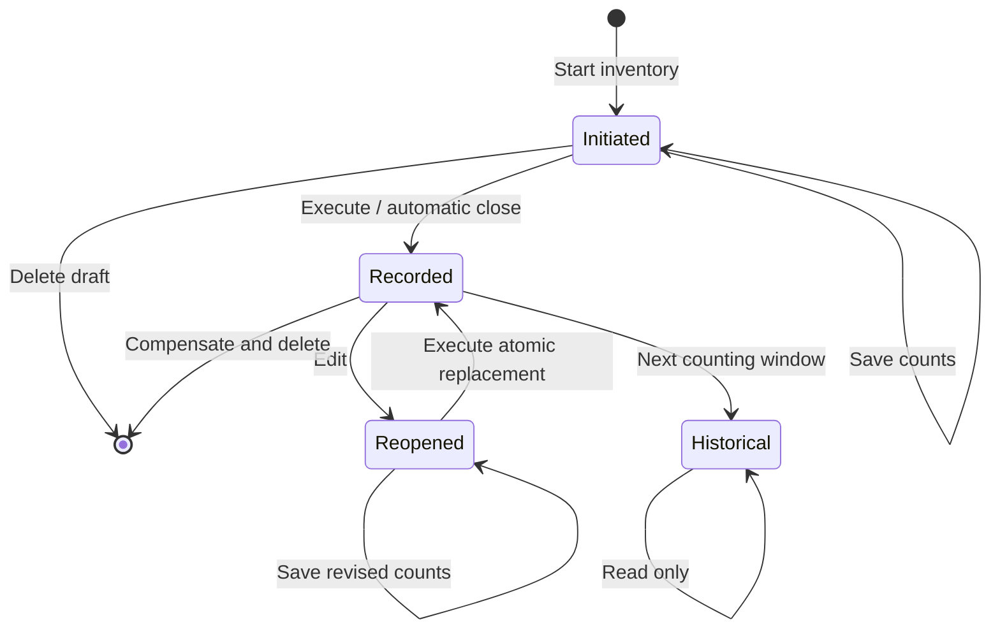

# KreaProducts Inventory Procedure and Technical Logic

Copyright (C) 2026 Kreativität Works <mail@kreativitat.com>

This document describes the managed physical-inventory workflow implemented by
KreaProducts 4.22.0. It covers the Dolibarr and mobile interfaces because both
use the same `KreaProductsMobileInventoryService` business boundary.

The source code remains authoritative. This document must be updated whenever
the managed inventory lifecycle, permissions, timing rules, stock arithmetic,
or audit model changes.

## 1. Purpose

The managed inventory workflow records a physical count at an immutable
start-of-day timestamp while preserving all operational movements that occurred
after that timestamp.

The workflow is designed to guarantee that:

- one category and warehouse scope has only one open inventory at a time;
- stock is never changed merely by saving a count;
- executing an inventory adjusts only the difference at the inventory anchor;
- later sales, receipts, and production movements remain effective;
- edits and deletions preserve an append-only stock audit trail;
- older recorded inventories become permanent read-only history;
- all critical writes are entity-scoped, permission-checked, locked, and
  transactional.

## 2. Business Terms

| Term | Meaning |
| --- | --- |
| Template | A direct product subcategory of the configured inventory root category. |
| Scope | Active entity + template category + warehouse. |
| Counting window | The business calendar date selected by the entry cutoff in the configured timezone. |
| Inventory anchor | The selected calendar date at `KREAPRODUCTS_BUSINESS_DAY_CLOSE_TIME`. |
| Current stock | Live Dolibarr warehouse or batch stock when the inventory is executed. |
| Post-anchor movements | Net operational stock movements strictly after the inventory anchor. |
| Expected quantity | Reconstructed theoretical stock at the inventory anchor. |
| Counted quantity | Absolute physical quantity entered by the user. |
| Adjustment | Signed stock movement required to make anchor stock equal the physical count. |
| Active generation | The current append-only set of adjustment audit rows for the counted lines of a recorded inventory. |

## 3. Required Configuration

The following settings are entity-specific unless stated otherwise:

| Constant | Default | Function |
| --- | ---: | --- |
| `KREAPRODUCTS_INVENTORY_CATEGORY_ROOT` | not set | Parent category whose direct product subcategories are inventory templates. |
| `KREAPRODUCTS_STOCK_DEFAULT_WAREHOUSE_ID` | not set | Default warehouse in the mobile workflow. |
| `KREAPRODUCTS_BUSINESS_DAY_CLOSE_TIME` | `06:00` | Single authoritative time for the inventory header, expected-stock reconstruction, displayed virtual stock, and adjustment movements. |
| `KREAPRODUCTS_BUSINESS_TIMEZONE` | `Europe/Lisbon` | Timezone used for cutoff, value-date, automatic-close, and counting-window decisions. |
| `KREAPRODUCTS_INVENTORY_AUTO_CLOSE_TIME` | `19:45` | Time at which due open inventories are automatically executed and the read-only interval begins. |
| `KREAPRODUCTS_INVENTORY_ENTRY_CUTOFF_TIME` | `20:00` | End of the read-only interval, expiry of the previous counting window, and beginning of the new-inventory entry lock. |
| `KREAPRODUCTS_INVENTORY_ENTRY_REOPEN_TIME` | `23:00` | End of the new-inventory entry lock. New inventories can be created again from this time. |
| `KREAPRODUCTS_STOCK_MOVEMENT_DATA` | `1` | Enables value-dated stock movements. Managed inventory creation and execution are refused when disabled. |
| `KREAPRODUCTS_STOCK_INVENTORY_LIST_LIMIT` | `30` | Number of inventory records returned to the mobile history, constrained to 1-200. |
| `KREAPRODUCTS_STOCK_INVENTORY_EMAIL_ENABLED` | `0` | Enables the recorded-inventory email report. |
| `KREAPRODUCTS_STOCK_INVENTORY_EMAIL_TO` | empty | Recipient of the recorded-inventory report. |

`KREAPRODUCTS_INVENTORY_DEFAULT_TIME` is a compatibility constant only. It is
not exposed in setup and is not used by the managed inventory workflow in
4.22.0.

The automatic-close time must be earlier than the entry cutoff, and the entry
reopening time must be later than the entry cutoff. The default same-day order
is therefore `19:45 < 20:00 < 23:00`. Clock values accept `H:MM`, `HH:MM`, and
optional seconds; the code normalizes them to `HH:MM:SS`.

### Default daily timeline

With the default values:

```text
06:00                 19:45            20:00                 23:00
  |---------------------|----------------|---------------------|
  Inventory anchor      Automatic close  Previous counts       New inventory
                        Full read-only    expire; creation      creation reopens
                        starts            stays locked
```

- An inventory started before 20:00 is assigned to 06:00 of the same calendar
  date.
- From 19:45 inclusive until 20:00 exclusive, interactive create, save,
  execute, edit, and delete operations are blocked. The scheduled close is the
  only mutation allowed in this interval.
- At 20:00, every count from the previous counting window expires. A user
  cannot select, save, edit, or execute a count for the previous day.
- From 20:00 inclusive until 23:00 exclusive, creation of a new inventory is
  blocked. Existing inventories remain consultable and follow their normal
  lifecycle rules, including deletion of an expired draft when authorized.
- At 23:00, new inventory creation reopens. The new inventory is assigned to
  06:00 of the next calendar date. The service still rejects any manually
  submitted value date from the previous day; reopening never revives an old
  physical count.

Related operational movements keep their own authoritative ordering. Supplier
invoice receipts default to 10:30 through `KREAPRODUCTS_SUPPLIER_MOVE_TIME`,
customer invoice movements use the authoritative invoice datetime, and
automatic-dismantling MO movements retain their source operational datetime.
With a 06:00 inventory anchor, those later movements remain after the physical
count rather than being absorbed by its adjustment.

## 4. Permissions

| Capability | Required rights |
| --- | --- |
| Read inventory | `kreaproducts->stockmobile->read` and Dolibarr `stock->lire`. |
| Save physical counts | Read rights plus `kreaproducts->stockinventory->write`. |
| View expected stock, deviations, and statistics for the current counting window | `kreaproducts->inventory->expected`. |
| View expected stock and deviations for a permanently locked recorded inventory from an older counting window | Inventory read rights; statistics remain protected by `kreaproducts->inventory->expected`. |
| Execute, edit, or delete stock-affecting inventory | Count rights plus `kreaproducts->stockinventory->close`, and either advanced inventory write permission or stock-movement creation permission according to Dolibarr advanced-permission mode. |
| Scheduled automatic close | An active internal Dolibarr administrator resolved by the cron job. |

The analysis permission is deliberately independent from count permission. A
user may count without seeing expected stock or deviations. Removing this
module permission does not hide stock exposed by other Dolibarr pages; blind
counting also requires review of the user's core product and stock rights.

## 5. Inventory States and Available Actions

| State | Stock effects | Available actions |
| --- | --- | --- |
| Initiated, no saved count | None | Save, Delete. |
| Initiated, at least one saved count | None | Save, Execute stock movements, Delete. |
| Recorded in current counting window | Active adjustment rows for every counted line | Edit when an active generation exists; Delete according to the stock-effect rules. |
| Recorded in an older counting window | Immutable historical stock and audit evidence | Read only. |
| Initiated in an older counting window | None, unless it is a reopened revision | Read and Delete only outside the daily read-only interval. Counts are expired and cannot be saved or executed. |
| Reopened recorded inventory | Previous generation remains active | Save revised counts, Execute replacement, Delete. |

There is no user-facing Revert state or direct reversal action. Compensation is
an internal part of Edit re-execution or Delete.



## 6. Operator Procedure

### 6.1 Preparation

1. Confirm that the correct Dolibarr entity is active.
2. Confirm that the inventory root category and default warehouse are configured.
3. Confirm that every product to be counted is:
   - a product rather than a service;
   - linked directly to the intended template category;
   - stock-managed;
   - available in the active product entity scope.
4. Confirm that the scheduled job is enabled and running once per minute.
5. Confirm that the business timezone, start-of-day anchor, automatic-close
   time, entry cutoff, and entry reopening time represent the intended
   operational day.
6. Do not change inventory timing constants while an inventory is open unless
   the effect on its already-persisted anchor has been reviewed.

When Dolibarr composed-product child movements are enabled and parent movements
are disabled, kit parents are not independently maintained stock. The workflow
excludes those parents from new inventories and counts the operational child
stock instead. Existing audited legacy parent rows may be compensated, but new
unsupported parent adjustments are refused.

### 6.2 Start the inventory

1. Confirm that the current time is outside both the full read-only interval
   and the configured new-inventory entry lock.
2. Select a template category and warehouse.
3. Start the inventory from the Dolibarr page or mobile application.
4. Verify the provisional reference, title, warehouse, and value date.

The service then performs one transaction:

1. checks count permission, the full mutation window, the new-inventory entry
   window, and value-dating configuration;
2. validates the category and warehouse in their active Dolibarr entity scopes;
3. locks the category and warehouse scope;
4. rejects another initiated inventory in the same entity, category, and warehouse;
5. rejects an overlapping or non-monotonic value date;
6. creates a native Dolibarr `Inventory` with `import_key = 'KPS'`;
7. assigns a Dolibarr-style provisional reference such as `(PROV000123)`;
8. validates the inventory into the module's Initiated/Started state;
9. creates category product lines, including missing zero-stock products;
10. removes non-operational kit-parent lines when required by the Dolibarr kit
    movement configuration;
11. commits only after the complete inventory header and line set succeeds.

The uniqueness gate is scoped narrowly. Another category or another warehouse
may have its own open inventory.

### 6.3 Enter and save physical counts

1. Enter the absolute physical quantity for each counted product or lot.
2. Leave a field blank when that product was not counted.
3. Use Save as often as required.

Count rules:

- quantities must be numeric, finite, and zero or positive;
- zero is a valid physical count;
- blank means not counted, not zero;
- Save writes `inventorydet.qty_view` only and creates no stock movement;
- saving a first-generation draft may also save its permitted calendar date;
- the permitted calendar date is exactly the current counting-window date;
- a prior-day date is rejected server-side even if a client bypasses the HTML
  date limits or submits directly to the mobile endpoint;
- a reopened recorded inventory keeps the original generation's exact anchor;
  its date cannot be changed;
- all submitted lines must belong to the same entity-scoped inventory;
- the inventory header and lines are locked before update, and every save is
  committed or rolled back as one transaction.

Users with analysis permission see the expected quantity, the virtual stock at
the configured start-of-day snapshot, the absolute deviation, and the relative
deviation. For the current counting window, those values are omitted when the
permission is absent so employees can count without seeing the expected result.
Once a recorded inventory belongs to an older counting window and is
permanently read-only, users with inventory read access may see those values;
the Statistics tab still requires the analysis permission.

### 6.4 Execute stock movements and record

The interactive interfaces expose execution only when:

- the inventory is Initiated/Started;
- at least one line has a physical count;
- the inventory belongs to the current counting window;
- its calendar date is not in the future;
- it is the first open inventory in its scope;
- the daily mutation window is open;
- the user has close permission.

If any line is blank, interactive execution requires explicit confirmation.
The scheduled automatic close is allowed to complete an incomplete or entirely
blank inventory. Blank lines remain unchanged and produce no adjustment audit
row in that generation.

For every counted product, warehouse, and batch, the service calculates:

```text
expected_at_anchor = current_live_stock - operational_movements_after_anchor
adjustment          = physical_count - expected_at_anchor
```

The service then:

1. locks the scope, inventory header, stock rows, and inventory lines;
2. verifies date monotonicity and the absence of a later active product anchor;
3. normalizes relevant supplier and customer invoice movement dates;
4. compensates the active generation first when executing a reopened inventory;
5. creates a native Dolibarr stock movement for each non-zero adjustment at the
   immutable inventory anchor;
6. updates `inventorydet.qty_stock` with the finalized expected quantity and
   links its movement when one exists;
7. writes one immutable `kreaproducts_inventory_adjustment` row for every
   counted line, including zero adjustments;
8. assigns the final reference `YYYYMMDD_CATEGORY`, adding `_Vn` only when
   required for uniqueness;
9. moves the native inventory to Recorded status;
10. commits all stock, audit, line, reference, and status writes together;
11. sends the optional completion email only after the successful commit.

#### Worked example

Assume an inventory is anchored at 06:00:

```text
Current live stock at execution                         118
Net operational movements after 06:00                  +18
Expected stock at 06:00                 118 - 18 =      100
Physical count at 06:00                                 96
Inventory adjustment                     96 - 100 =      -4
Live stock after adjustment              118 - 4 =       114
```

The final live stock is 114, not 96, because the `+18` of legitimate
post-anchor operations remains effective: `96 + 18 = 114`.

### 6.5 Edit a recorded inventory

Edit is available only for the latest recorded inventory in the same entity,
category, and warehouse, while it still belongs to the current counting window
and has an active adjustment generation.

Edit does not reverse stock immediately. It:

1. locks and revalidates the scope and inventory;
2. restores the inventory header to Initiated/Started;
3. preserves the active generation's exact value timestamp;
4. leaves the existing stock movements and active audit generation in effect;
5. allows revised counts to be staged in `inventorydet.qty_view`.

When the revised inventory is executed, one transaction:

1. creates opposite movements for the active adjustment generation;
2. marks that generation reversed with the real reversal audit time;
3. compensates any active correction and rebase movements;
4. recalculates expected stock from the live ledger;
5. posts the replacement adjustments at the original anchor;
6. inserts a new active audit generation;
7. returns the inventory to Recorded status.

Users never observe a partially reversed inventory. A failure rolls the entire
replacement back.

### 6.6 Delete an inventory

Deletion depends on state:

- An ordinary initiated inventory with no active stock effects may be deleted
  with count permission.
- A reopened or recorded inventory with active stock effects requires close
  permission and must be the latest inventory of its category and warehouse.
- A recorded inventory can be deleted only in its current counting window.
- An older recorded inventory is permanent read-only history.
- An expired initiated inventory may be deleted outside the daily read-only
  interval so that a fresh inventory can be created and all products recounted.

Deleting a stock-affecting inventory is an atomic compensation-and-delete
operation. The service creates equal opposite stock movements using the
effective timestamp of each movement being cancelled, records the real reversal
time in the audit rows, changes the native inventory to Draft, and deletes its
header and detail rows. Original movements, opposite movements, and module audit
rows remain as immutable stock history.

Direct SQL deletion of inventory, audit, or stock-movement rows is prohibited.

### 6.7 Automatic closure

The module registers `KreaProductsInventoryCron::closeDueInventories` as an
enabled one-minute Dolibarr scheduled job when the module is activated.

For the active cron entity, the job:

1. resolves an active internal administrator for audit attribution;
2. selects KPS/legacy KS inventories still in Initiated/Started status;
3. considers an inventory due when the current time reaches the configured
   automatic-close time on its value-date calendar day;
4. executes each due inventory independently with incomplete closure allowed;
5. reports the number due, the number closed, and per-inventory errors;
6. returns failure when any due inventory fails, without concealing inventories
   that closed successfully.

The scheduled entry point bypasses only the interactive read-only-window check.
It retains entity scoping, locking, date validation, stock reconstruction,
transactions, and audit writes.

## 7. How Stock Reconstruction Works

### 7.1 Open inventory

Before an inventory has an active recorded generation, its original
`inventorydet.qty_stock` is only an initial prefill. The displayed start-of-day
virtual stock is reconstructed from current live stock minus operational
movements after the anchor.

### 7.2 Recorded inventory

At execution, `inventorydet.qty_stock` becomes the immutable expected quantity
at the anchor. The active adjustment audit row stores:

- live stock immediately before execution;
- net operational movement after the anchor;
- expected anchor quantity;
- physical counted quantity;
- signed adjustment quantity;
- original movement link;
- author and creation timestamp;
- reversal movement, author, and timestamp when later compensated.

### 7.3 Excluded ledger origins

The following internal origins are excluded from operational movement sums so
inventory corrections are never counted twice:

- `inventory`;
- `kreaproducts_inventory_reversal`;
- `kreaproducts_inventory_reinstatement`;
- `kreaproducts_inventory_rebase`;
- `kreaproducts_inventory_rebase_reversal`;
- `kreaproducts_count_correction`;
- `kreaproducts_count_correction_reversal`.

### 7.4 Late or backdated operational movements

Customer invoice, supplier invoice, and module-generated MO movements may be
created after an inventory is recorded while carrying an effective datetime
before its anchor. KreaProducts does not rewrite or delete the recorded
inventory. It creates a deterministic equal-opposite rebase movement at the
next active inventory anchor so the immutable physical count remains
authoritative. Rebase operations are append-only and idempotent.

When there is no later anchor, live stock is rebuilt from the latest valid
active anchor and subsequent operational movements. If no valid anchor exists
in a history-truncated system, the service leaves Dolibarr live stock unchanged
rather than inventing a baseline.

## 8. Database and Entity Scope

| Table | Scope and role |
| --- | --- |
| `inventory` | Direct `entity`; native header, status, category, warehouse, anchor, reference, and `import_key`. |
| `inventorydet` | Scoped through its inventory parent; product/warehouse/batch line, expected quantity, count, and movement link. |
| `kreaproducts_inventory_adjustment` | Direct `entity`; append-only adjustment generations and reversal linkage. |
| `kreaproducts_inventory_correction` | Direct `entity`; legacy append-only count corrections and reversal linkage. New user-facing correction mode is disabled. |
| `stock_mouvement` | No direct entity; isolated through entity-valid product, warehouse, and inventory origin. Stores original, reversal, rebase, and rebase-reversal movements. |
| `product_stock` | No direct entity; isolated through entity-valid product and warehouse. Provides live stock. |
| `product_batch` | Scoped through `product_stock`; provides lot-specific live stock. |
| `categorie` / `categorie_product` | Templates are direct child categories in `getEntity('category')`; products are validated through `getEntity('product')`. |
| `entrepot` | Warehouse must be active and belong to `getEntity('stock')`. |

Every critical mutation begins a database transaction, locks the category and
warehouse scope, then locks the inventory header and lines. New write paths must
preserve this lock order to avoid close/save races and deadlocks.

## 9. Interface Parity

The following interfaces are adapters over the same service and must not
implement separate inventory arithmetic:

- `inventory.php`: native Dolibarr inventory detail, count, execute, edit, and
  delete UI;
- `inventory_list.php`: managed and native inventory history routing;
- `stock_mobile.php`: authenticated JSON boundary and mobile application shell;
- `KreaProductsInventoryCron`: automatic scheduled execution.

Mobile mutation requests are POST-only and require a CSRF token. The service
returns business-safe messages; unexpected technical details are logged rather
than exposed to the client.

## 10. Main Code Map

| File | Responsibility |
| --- | --- |
| `class/KreaProductsMobileInventoryService.class.php` | Authoritative lifecycle, permissions, entity validation, locks, transactions, counting windows, stock execution, edit, delete, and email. |
| `class/KreaProductsBusinessDayService.class.php` | Time normalization, anchor resolution, cutoff logic, full read-only interval, entry lock, and current-window date validation. |
| `class/KreaProductsInventoryLedgerCalculator.class.php` | Pure count normalization and stock formulas. |
| `class/KreaProductsInventoryMovementService.class.php` | Dolibarr-native stock movement creation and kit-parent safety. |
| `class/KreaProductsStockMovementService.class.php` | Invoice/MO movement dating, historical reconstruction, and append-only rebases. |
| `class/KreaProductsInventoryCron.class.php` | Per-entity automatic closure through an audited administrator. |
| `class/KreaProductsInventoryService.class.php` | Native inventory trigger compatibility and historical line prefilling. |
| `core/triggers/interface_99_modKreaProducts_KreaProductsTriggers.class.php` | Routes Dolibarr stock and inventory lifecycle triggers. |
| `inventory.php` | Dolibarr UI adapter. |
| `stock_mobile.php` | Mobile JSON and PWA adapter. |
| `sql/llx_kreaproducts_inventory_adjustment.sql` | Adjustment-generation audit schema. |
| `sql/llx_kreaproducts_inventory_correction.sql` | Legacy count-correction audit schema. |
| `tests/run_stock_logic_tests.php` | Focused inventory and stock regression assertions. |

## 11. Known 4.22.0 Limitation

The scheduled close permits an entirely blank inventory to become Recorded.
Because no line was counted, that record has no active adjustment audit rows.
Edit is therefore unavailable. The current capability calculation may still
show Delete for the latest current-window record, but `deleteInventory()` enters
the compensation path and rejects the deletion because the adjustment audit is
missing.

Until that runtime edge is corrected:

- do not leave an unused inventory open for automatic closure;
- delete an unused draft before the read-only interval begins;
- enter zero only when the product was physically counted and the observed
  quantity is genuinely zero;
- do not manufacture an audit row or delete the recorded row with direct SQL.

The future runtime fix must align the displayed delete capability and the
service deletion path for a legitimately all-blank recorded inventory without
weakening audit validation for stock-affecting inventories.

## 12. Operational Failure Procedure

If an inventory cannot be saved or executed:

1. Do not edit `inventory`, `inventorydet`, `product_stock`, or
   `stock_mouvement` manually.
2. Record the entity, inventory id/reference, category, warehouse, value date,
   current time, and exact user-facing error.
3. Check whether the time is inside the read-only interval.
4. Check whether the inventory belongs to an expired counting window.
5. Check for an older open inventory in the same category and warehouse.
6. Check permissions, including Dolibarr's advanced inventory permission mode.
7. Check that all counted products are stock-managed and entity-valid.
8. Check the scheduled-job result and Dolibarr log for the exact transaction
   failure.
9. Check for a later active physical-inventory anchor before attempting an edit
   or deletion.
10. Use an append-only, backup-first repair only after the source movement and
    audit generation have been reconciled. Never delete stock evidence to make
    totals appear correct.

## 13. Validation Checklist for Future Changes

Before releasing an inventory change, verify:

- entity, category, warehouse, product, and batch isolation;
- permission gates in both UI capability flags and service mutations;
- one-open-inventory enforcement under locks for every mutation path;
- before-cutoff, automatic-close, full read-only, exact-cutoff, entry-lock,
  exact-reopening, prior-day, and future-date boundaries in the configured
  timezone;
- Save creates no stock movement;
- blank, zero, decimal, invalid, and negative count behavior;
- complete and explicitly confirmed incomplete execution;
- automatic closure of an entirely blank inventory and its subsequent
  capability flags and deletion lifecycle;
- the reconstruction and adjustment formulas with post-anchor movements;
- zero-adjustment audit rows;
- edit leaves the active generation in effect until atomic re-execution;
- delete creates compensation movements and preserves audit rows;
- historical inventories are service-level read-only;
- customer, supplier, MO, rebase, reversal, and batch behavior;
- transaction begin, rollback, commit, and commit-failure handling;
- Dolibarr UI and mobile responses use the same service result;
- cron closure is enabled, entity-correct, and auditable;
- `tests/run_stock_logic_tests.php`, PHP lint, frontend build, translation
  parity, and a rendered/authenticated workflow pass.
